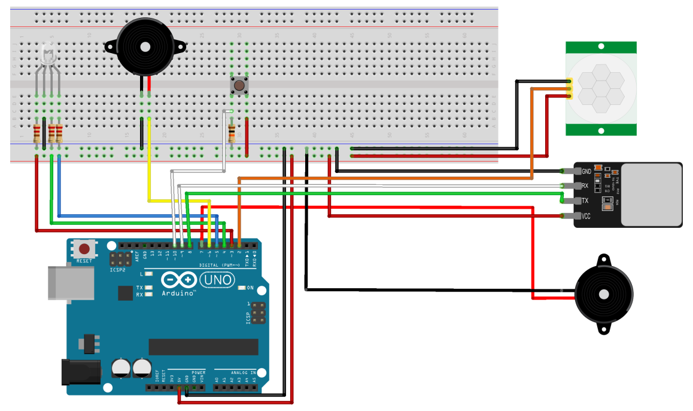

# Alarm System

An alarm system triggered by IR motion detection with biometric (fingerprint) user verification built with Arduino. 

Green LED indicates ready.

Yellow LED indicates armed.

Red LED indicates triggered.

Blue LED indicates fingerprint setting.
Place fingerprint and press button to set new fingerprint.

Softer buzzer tone for 30 second period to disarm.

Louder hi-lo alarm tone after 30 second period.

Fingerprint sensor to arm/disarm.

***

List of Materials: 
- Arduino UNO R3 x1
- USB A-to-B Cable x1
- Breadboard x1
- RGB LED x1
- Piezo Buzzer x1
- SFM-27 Piezo Buzzer/Alarm x1
- HC-SR501 IR Motion Sensor x1
- AS608 Optical Fingerprint Sensor x1
- Button x1
- 220 Ω Resistor x3
- 10 K Ω Resistor x1
- Jumper Wire x18

***

Wiring Diagram: 

***

Photos:

***

Features to implement: 
- WiFi notifications to app using ESP8266
- Proper housing
